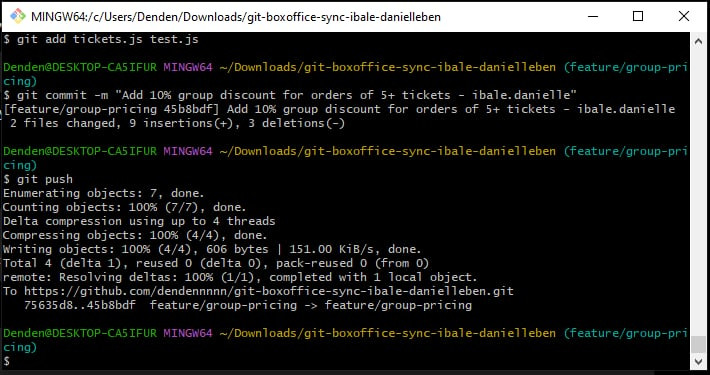
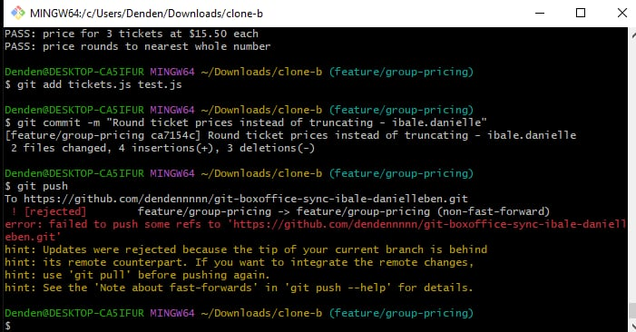
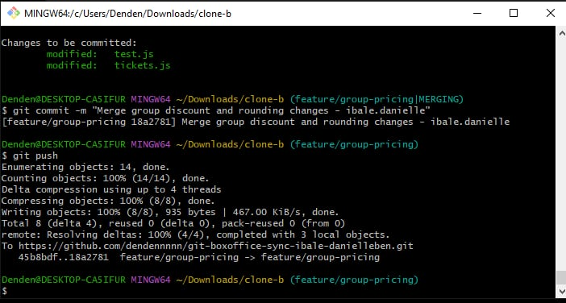
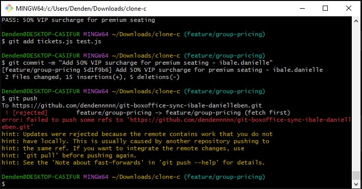
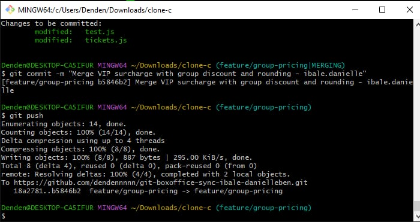
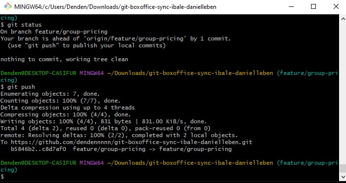
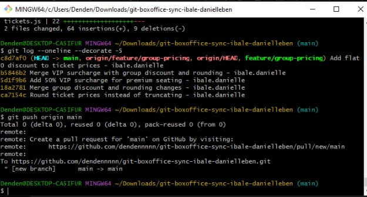

# Box Office Sync: Workflow

## Task 1 — Group Discount

I created the `feature/group-pricing` branch in Clone A and added a 10% discount for orders of 5 or more tickets. I tested the change, committed it using the required name format, and pushed it to GitHub.

---

## Task 2 — Rounding Change and Rejected Push

In Clone B, I started from the older version of the branch and changed the ticket price calculation from truncating the result with `Math.floor()` to rounding it with `Math.round()`. I committed the change and attempted to push it.

The push was rejected because Clone B did not yet contain Clone A's newer commit. This demonstrated a non-fast-forward push rejection.

---

## Task 3 — Two-Way Merge

I fetched the latest changes in Clone B and merged the remote branch into my local branch. Git reported conflicts in `tickets.js` and `test.js`.

I resolved the conflicts by keeping both the 10% group discount from Clone A and the rounding change from Clone B. I then ran the tests and confirmed that the tests passed before committing the merge and pushing it.

---

## Task 4 — VIP Surcharge and Rejected Push

Clone C had been created before the previous changes were synchronized. I added a 50% VIP surcharge for premium seating, committed the change, and attempted to push it.

The push was rejected because the remote `feature/group-pricing` branch had already advanced with the work from the other contributors.

---

## Task 5 — Three-Way Merge

In Clone C, I fetched the updated remote branch and merged it into my local branch. This produced conflicts because the branch now contained work from multiple contributors.

I resolved the conflicts so that all three behaviors survived:

- 10% group discount for 5 or more tickets
- rounding the final price
- 50% VIP surcharge for premium seating

I also updated the tests to match the combined behavior, ran the tests, confirmed they passed, committed the merge, and pushed the result.

---

## Task 6 — Rebase and Flat $10 Discount

Back in Clone A, I added a flat $10 discount to every order without first fetching the newer remote changes. The initial push was rejected because the remote branch had newer commits.

Instead of merging, I used `git fetch` followed by `git rebase`. The rebase produced conflicts in both `tickets.js` and `test.js`.

I resolved the conflicts so that all four behaviors survived:

1. 10% group discount
2. rounding instead of truncating
3. 50% VIP surcharge
4. flat $10 discount

The combined tests passed. I continued the rebase and then successfully pushed the rebased branch without using force push.

---

## Task 7 — Merge into Main and Tag

After completing the feature branch, I switched to `main` and merged `feature/group-pricing` into it. I pushed the final `main` branch to GitHub.

I then created the `v1.0-synced` tag for the final synchronized version and pushed the tag to GitHub.

---

# Required Questions

## 1. Walk through the final `calculateTicketPrice` function and name which contributor's change is responsible for each part.

The final `calculateTicketPrice` function combines all four changes.

First, the base price is calculated using the quantity multiplied by the base ticket price. This was part of the original starter implementation.

Next, the function checks whether the order contains 5 or more tickets. If it does, the price is multiplied by `0.90`, giving a 10% group discount. This was the group-pricing change from the first contributor in Clone A.

After that, the function checks whether the order is for premium seating. If it is, the price is multiplied by `1.50`, applying the 50% VIP surcharge. This was the VIP change from the third contributor in Clone C.

The function then subtracts `$10` from the price. This was my final change in Task 6.

Finally, the result is passed through `Math.round()`. This came from the second contributor's rounding change in Clone B, replacing the original truncation behavior.

Therefore, the final calculation contains the original calculation plus the group discount, VIP surcharge, flat $10 discount, and rounding behavior.

---

## 2. Compare Task 3's two-way conflict to Task 5's three-way conflict. What got harder with a third line of work?

Task 3 involved two different lines of work: the group discount and the rounding change. Both contributors changed the same calculation area, so Git could not automatically combine everything and required a conflict to be resolved.

Task 5 was harder because a third contributor had made another change to the same shared calculation before the previous work was fully synchronized. The conflict therefore involved three different behaviors instead of two.

The main difficulty was that I could not simply choose one side of the conflict. I had to understand what each change was supposed to do and combine all three behaviors into one correct implementation. The tests were also important because they verified that the combined result still behaved correctly.

---

## 3. Task 6's flat $10 discount changed the expected result of tests unrelated to your change. Why, and what does that tell you about "isolated" changes in shared code?

The flat $10 discount was added inside the shared `calculateTicketPrice` function. Because the group-discount and VIP calculations also use this function, the new $10 discount was applied to their results as well.

For example, the 5-ticket group calculation originally produced $90 after the 10% discount. After adding the flat $10 discount, it became $80.

The VIP calculation was also affected because the $10 discount was applied after the VIP surcharge.

This shows that a change can be logically small but still affect other features when they share the same function or code path. Tests that appear unrelated can fail because they depend on shared code. It also shows why the full test suite should be run after integrating changes instead of testing only the newly added behavior.

---

## 4. If this were a real team of three, what one process change would have prevented all three rejected pushes?

The main process change would be requiring each contributor to fetch and synchronize with the shared remote branch before starting work and before pushing.

For example, the team could use a rule that contributors must run `git fetch` and update their working branch before beginning a task and must integrate the latest remote changes before pushing.

This would reduce the chance of multiple people pushing unrelated changes based on an outdated version of the same branch. In a real team, a pull request workflow with code review would also make this synchronization easier to manage.